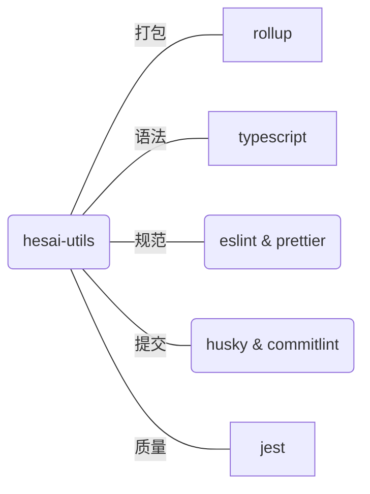

## 一、目的

减少重复，快速实现组件复用，拒绝重复造轮子

> Don't repeat yourself

## 二、准备工作

### 1. 打包工具对比

|          | webpack | rollup |
| -------- | ------- | ------ |
| 执行时间 | 71ms    | 17ms   |
| 文件大小 | 389KB   | 262KB  |

::: echarts 对比图

```json
{
  "colors": ["#5470C6", "#91CC75", "#EE6666"],
  "xAxis": [
    {
      "type": "category",
      "data": ["webpack", "rollup"]
    }
  ],
  "yAxis": [
    {
      "type": "value",
      "name": "执行时间",
      "position": "right",
      "axisLabel": {
        "formatter": "{value} ms"
      }
    },
    {
      "type": "value",
      "name": "文件大小",
      "position": "left",
      "axisLabel": {
        "formatter": "{value} kb"
      }
    }
  ],
  "series": [
    {
      "name": "执行时间",
      "type": "bar",
      "data": [71, 17]
    },
    {
      "name": "文件大小",
      "type": "bar",
      "data": [389, 262],
      "yAxisIndex": 1
    }
  ]
}
```

:::

::: info rollup 明显胜出, 最主要是 rollup 打包速度快呀
:::

### 2. 谁再用?

虽然 rollup 出来的比较晚，总体生态可能不如 webpack，但也有很多优秀的框架在使用它

- vue
- vite
- pinia
- redux

## 三、直接开干

### 1. 工具库有哪些部分组成 ？



### 2. 工具库初始化

2.1 初始化仓库，并调整 `package.json` 配置文件

> 万事开头难

进度：<progress value="5" max="100"></progress> 5%

```sh
# 初始化
npm init
```

```json
{
  "name": "js-utils",
  "version": "1.0.0",
  // 发布到公有仓库后的一个说明, 方便检索
  "description": "HESAI前端工具库",
  // 入口文件, 其他项目引入当前包时的入口
  "main": "index.js",
  "scripts": {
    "test": "npm run test"
  },
  "repository": {
    "type": "git",
    "url": "https://github.com/ZhixianKwok/js-utils.git"
  },
  // 方便在npm类似的网站上进行快速检索
  "keywords": ["utils", "工具库"],
  "author": "guozhixian",
  "license": "ISC"
}
```

详细代码
<StackBlitz id="amos-js-utils" height="50vh" hideExplorer hideNavigation file="package.json" view="editor"/>

### 3. 安装工具库

进度：<progress value="40" max="100"></progress> 40%

3.1 `rollup`安装

::: code-tabs#shell

@tab npm

```bash
npm install --save-dev rollup
```

@tab pnpm

```bash
pnpm install --save-dev rollup
```

@tab yarn

```bash
yarn add rollup --dev
```

:::

3.2 `typescript`安装

::: tip 以下包的安装方式与 3.1 类似，下面将以 npm 为准，其他安装方式可以参考 3.1, 举一反三。
:::

- 安装

```sh
npm install --save-dev typescript
```

- 配置 tsconfig.json

```json
{
  "compilerOptions": {
    "target": "es2016",
    "lib": ["esnext"],
    "allowJs": true,
    "skipLibCheck": true,
    "esModuleInterop": true,
    "allowSyntheticDefaultImports": true,
    "strict": true,
    "forceConsistentCasingInFileNames": true,
    "noFallthroughCasesInSwitch": true,
    "module": "esnext",
    "moduleResolution": "node",
    "resolveJsonModule": true,
    "isolatedModules": true,
    "noEmit": true,
    // 用于设置别名
    "baseUrl": ".",
    "paths": {
      "@/*": ["src/*"]
    }
  },
  "include": ["src/**/*", "*.js"]
}
```

详细代码
<StackBlitz id="amos-js-utils" height="50vh" hideExplorer hideNavigation file="tsconfig.json" view="editor"/>

3.3 `eslint` & `prettier` 的安装

- `eslint` 安装

> eslint: Find and fix problems in your JavaScript code

```sh
npm install --save-dev eslint
```

::: info
eslint 本身很庞大，熟悉所有配置需要花费大量的时间，可以通过第三方的规范来约束我们，比如 airbnb、alibaba 等已有的大厂规范，这里我们以 airbnb 的为例
:::

```sh
# 安装基本版本即可，这里不涉及组件
npm install --save-dev eslint-config-airbnb-base
```

airbnb 的`JavaScript`规范见：https://github.com/airbnb/javascript

- `eslintrc` 配置， 新增 `eslintrc.js文件`

```json
{
  "extends": ["airbnb-base", "prettier"],
  "plugins": ["prettier"],
  "rules": {
    "prettier/prettier": "error"
  }
}
```

<StackBlitz id="amos-js-utils" height="50vh" hideExplorer hideNavigation file=".eslintrc.json" view="editor"/>

- `prettier` 安装

```sh
# eslint-plugin-prettier方便和eslint结合使用
npm install --save-dev  prettier eslint-plugin-prettier
```

- `prettier` 配置

```json
{
  "singleQuote": true,
  "trailingComma": "es5",
  "printWidth": 100,
  "proseWrap": "never",
  "endOfLine": "lf",
  "semi": false
}
```

详细代码
<StackBlitz id="amos-js-utils" height="50vh" hideExplorer hideNavigation file=".prettierrc" view="editor"/>

3.4 husky & lint-staged & commitlint & commitizen & commitlint-config-cz

==提交相关的建议在本地尝试，StackBlitz 远程执行 husky 命令时存在一些问题！！！==

::: info 以下内容建议在本地尝试

- 安装 husky

> husky 是什么：Modern native Git hooks made easy

```sh
npm install --save-dev husky
```

- 配置 package.json

> StackBlitz 不支持 npm set-script，可以直接添加到将`"prepare": "husky install"`添加到 package.json 中，并执行 npm run prepare

```sh
npm set-script prepare "husky install"
npm run prepare
```

- 安装 lint-staged

> 什么是 lint-staged: Run linters against staged git files and don't let 💩 slip into your code base!

```sh
npm install --save-dev lint-staged
```

- 配置 lint-staged 阶段需要校验的文件类型

```json
{
  "name": "js-utils",
  "version": "1.0.0",
  "description": "HESAI前端工具库",
  "main": "index.js",
  "scripts": {
    "prepare": "husky install",
    "test": "npm run test"
  },
  "repository": {
    "type": "git",
    "url": "https://github.com/ZhixianKwok/js-utils.git"
  },
  "keywords": ["utils", "工具库"],
  "author": "guozhixian",
  "license": "ISC",
  "devDependencies": {
    "eslint": "^8.20.0",
    "eslint-config-airbnb-base": "^15.0.0",
    "eslint-plugin-prettier": "^4.2.1",
    "husky": "^8.0.1",
    "lint-staged": "^13.0.3",
    "rollup": "^2.77.2",
    "typescript": "^4.7.4"
  },
  "lint-staged": {
    "**/*.{js,ts}": ["prettier --write", "eslint"],
    "**/*.{md,json}": ["prettier --write"]
  }
}
```

详细代码
<StackBlitz id="amos-js-utils" height="50vh" hideExplorer hideNavigation file="package.json" view="editor"/>

:::

- 3.n 配置 `rollup` 文件

- 根目录添加 `rollup.config.js` 文件

### n. 辅助工具安装

```

```
